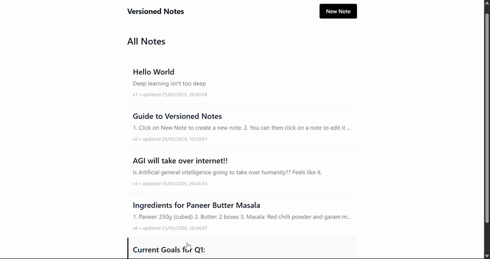

# 📝 Versioned Notes System

> A Git-like notepad where every edit is preserved — not overwritten.

<p align="center">
  
</p>

---

## Overview

Every time a note is updated or reverted, a **new version** is created rather than mutating the existing one. This gives you a reliable, append-only history — just like Git commits.

---

## Architecture

This project uses a **React** frontend and a **Python/Flask** backend, with a strict layered structure:

| Layer | Responsibility |
|---|---|
| **Routes** | HTTP parsing and request/response formatting only |
| **Services** | 100% of business logic (version rules, immutability enforcement) |
| **Models** | Database schema definitions |

---

## Why Immutability?

Instead of overwriting a note, we append a new version. This means:
- You can always view the **full history** of a note
- A "revert" simply creates a *new version* with the old content — no history is ever lost
- The system behaves like a simple, auditable ledger

---

## Tradeoffs

- **Storage:** Full copies of note text are stored per version. This avoids the complexity of diff-based storage (like Git packfiles or Operational Transformation) and is perfectly fine for a system at this scale. Python's `difflib` can generate diffs on-the-fly when viewing history.
- **Database:** SQLite is used for simplicity and portability. In a high-concurrency production setting, Postgres with strict transaction isolation would be preferred.

---

## How to Run Locally

### Backend
```bash
cd backend
python -m venv venv
.\\venv\\Scripts\\activate        # Windows
# source venv/bin/activate       # Mac/Linux
pip install -r requirements.txt
flask run --debug                # Runs on http://localhost:5000
```

### Frontend
```bash
cd frontend
npm install
npm run dev                      # Runs on http://localhost:5173
```
